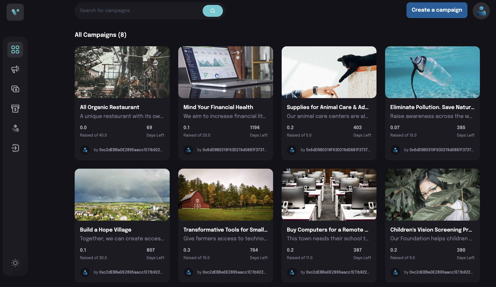
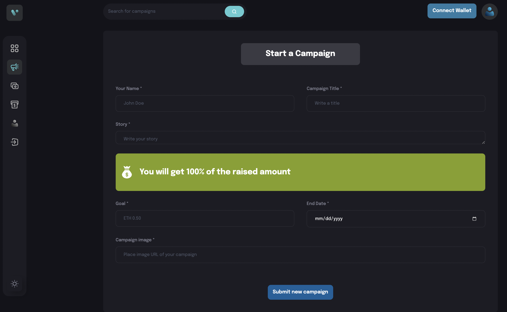
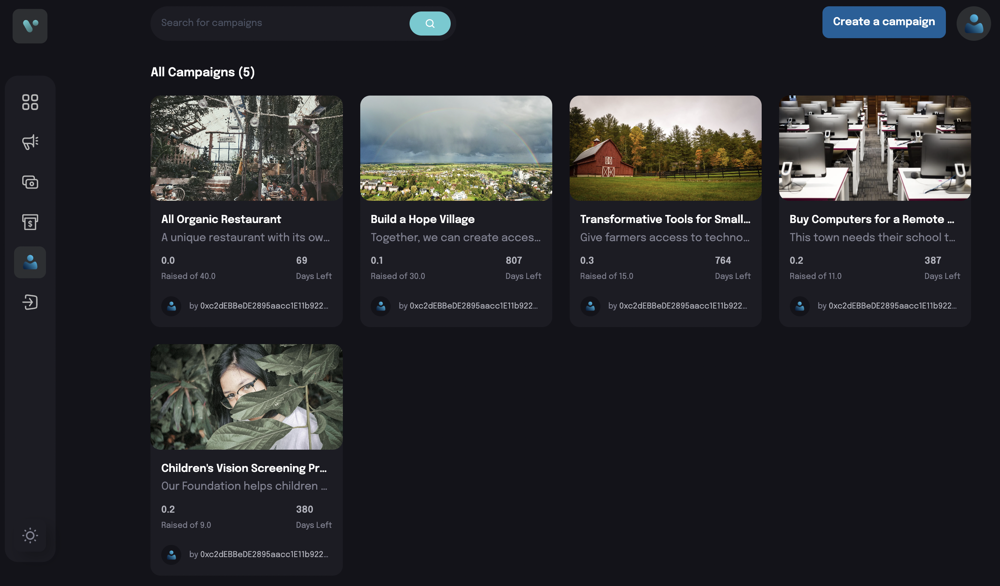
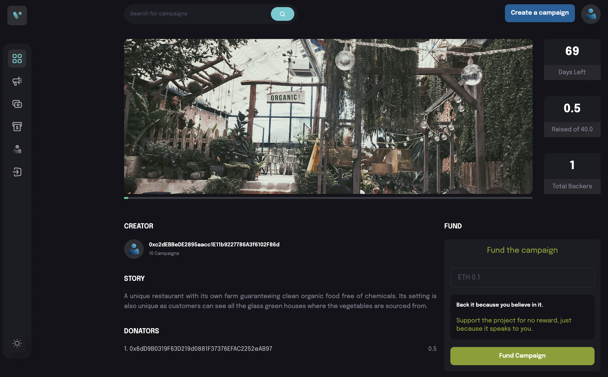

# A Crypto Crowdfunding DApp

## Site URL

[Crowdfunding DApp URL](https://crowdfunding.inovantech.com)

## About

This responsive Decentralized App implements some of the features of a crowdfunding app. Anyone can see and browse the list of campaings stored on the Blockchain. The DApp allows users to:

- Connect their wallet
- Create a crowdfunding campaign
- View their campaign
- Fund other users' campaigns with cryptocurrency (Currently just ETH).

Features to be added:

- Withdraw funds.

<div style="margin:0px;">
    
    <hr>
    
    <hr>
    
    <hr>
    
</div>

## To quickly test this Web3 DApp:

1. Go to: https://crowdfunding.inovantech.com
2. Install Metamask
3. Configure and select the Sepolia Testnet
   - RPC URL: https://sepolia.infura.io/v3/
   - Chain ID: 11155111

## Requirements and Setup

### Required Technologies and Libraries

```
Frontend:
    thirdweb-dev/react: 3.16.5
    thirdweb-dev/sdk: 3.10.67
    ethers: 5.7.2
    react: 18.2.0
    vitejs/plugin-react: 2
    tailwindcss: 3.2.4
    vite: 3

Backend:
    hardhat: 2.10.1
    thirdweb-dev/contracts: 3
```

### Deployment Instructions

- Create an account with Thirdweb and obtain a client Key:

```
https://thirdweb.com
```

- Update the `.env` file with your API Key:

```
/web3/.env
```

- Install all requisite npm packages under the `web3` directory:

```
npm install
```

- Install all requisite npm packages under the `client` directory:

```
npm install
```

- Compile the Smart Contracts under the `web3` directory:

```
npm run build
```

- Deploy the Smart Contracts under the `web3` directory:

```
npm run deploy
```

- Start the frontend web server:

```
npm run dev
```

- To test the app locally:

```
http://localhost:5173/
```
